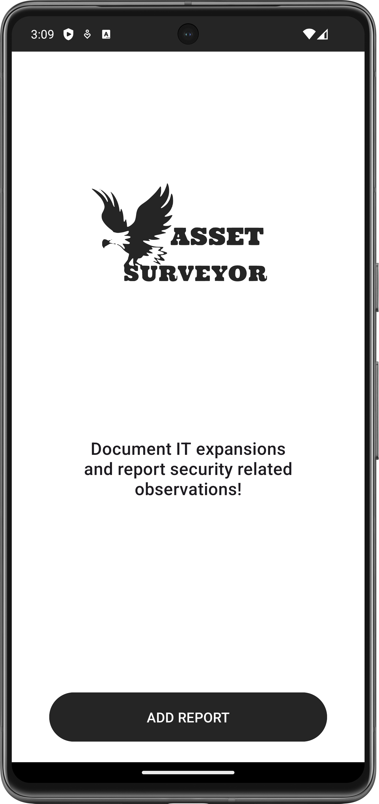

# AssetSurveyor

A notes app that saves images and GPS data in addition to text entries.

## App Screen Overview

## Task

Android app with room database. A list will appear in the database
of entries with the following values: description, photo, location.
Entries must be able to be created, edited and deleted in the app. The
The functionality of the app can be expanded as desired. There are no specifications for the GUI,
However, the app must meet the required requirements.

## Breakpoints

Points achievable: 70
10 points: App starts and displays GUI
10 points: App shows list of database entries
10 points: Database entries can be managed (insert, update, delete)
10 points: App saves the location (latitude, longitude)
10 points: App saves images in the database
10 points: Clicking on the database entry opens a detailed view of the respective entry.
10 points: Own functionality. For example, displaying the location on a map.

## Project specifications

Android app with room database.

The database contains a list of entries with the following:

- description
- photo
- location

It is possible to create, edit and delete entries in the app.

There are no specifications for the GUI.

### Features

- App starts and displays GUI
- App displays list of database entries
- Database entries can be managed (insert, update, delete)
- App saves the location (latitude, longitude)
- App saves images in the database
- Click on database entry to open detailed view of the respective entry

### Additional functionalities:

- Splash Startscreen
- Simple App logo as SVG graphic
- App shortcut for add a new note
- Send simple data to other apps with Android Sharesheet
- The stored location can displayed on GoogleMaps
- Two types of notes 1. normal Report 2. security relevant entry
- "Swipe to delete"

## How to run "AS app"
## Via Adroid Studio

1. Unpack the zip folder.
2. Open the whole project in Android Studio.
3. Gradle Build the project.
4. Sync & Run app configuration.

## Directly on the smart device
## (I recomend OS UpsideDownCake)

1. Transfer the AS.apk to your hard device
2. Make sure all permissions are set correctly
3. Lunch the App

### Note on Google Maps

The Secrets Gradle plug-in was used to store the API key for Google Maps. It reads secrets such as
API keys from attribute files that are not checked into a version management system.

To be able to use the project, you must store your own Google Maps API key.

Open the secrets.properties file in the top-level directory of your project.
_Note: If the secrets.properties file does not exist, create it in the same folder as the
local.properties file._

Insert the following code, replacing YOUR_API_KEY with your own API key: `MAPS_API_KEY=YOUR_API_KEY`

## About the build

### Test and development environment

Deloped with Android Studio Hedgehog.
Tested with emulated Pixel 3a    Android 14.0 ("UpsideDownCake").
Tested with emulated Pixel 7 Pro Android 14.0 ("UpsideDownCake").
Tested with live device Samsung Galaxy Tab S9 FE.

Properties
avd.ini.displayname              Pixel 3a API 34
avd.ini.encoding                 UTF-8
AvdId                            Pixel_3a_API_34
disk.dataPartition.size          6442450944

avd.ini.displayname              Pixel 7 Pro API
avd.ini.encoding                 UTF-8
AvdId                            Pixel_7_PRO_API
disk.dataPartition.size          6442450944

### SDK

minSdk = 24
targetSdk = 34
compileSdk = 34

### Gradle-Plugins

* com.android.application: This plugin is used to create the Android app.
* org.jetbrains.kotlin.android: This is the Kotlin plugin for Android.
* kotlin-kapt: This plugin is responsible for the Kotlin Annotation Processing Tool.
* com.google.android.libraries.mapsplatform.secrets-gradle-plugin: Responsible for handling API keys
  and secret data.

### Dependencies

* androidx.room:room-ktx:2.5.2: Android Room Database
* androidx.room:room-compiler:2.5.2: Annotation Processor for Room
* androidx.core:core-ktx:1.12.0: Kotlin Addons
* androidx.appcompat:appcompat:1.6.1: GUI
* junit:junit:4.13.2: Test Framework
* androidx.test.ext:junit:1.1.5: AndroidX Test Framework for JUnit
* androidx.test.espresso:espresso-core:3.5.1: Framework for UI Tests
* android.content.Intent
* android.os.Bundle
* android.view.Menu
* android.view.MenuItem
* android.view.View
* android.widget.TextView
* android.widget.Toast
* androidx.appcompat.app.AppCompatActivity
* androidx.recyclerview.widget.ItemTouchHelper
* androidx.recyclerview.widget.RecyclerView
* androidx.room.Room
* com.example.myapplication.adapters.NoteAdapter
* com.example.myapplication.dao.NoteDao
* com.example.myapplication.database.NotesDatabase
* com.example.myapplication.entities.Note
* com.google.android.material.floatingactionbutton.FloatingActionButton
* com.google.android.material.snackbar.Snackbar
* com.google.android.material:material:1.11.0: Material Design Components Library from Google
* androidx.constraintlayout:constraintlayout:2.1.4: Layout
* com.google.android.gms:play-services-maps:18.0.2: Google Maps Integration
* com.google.android.gms:play-services-location:21.0.1" Geo Location Services

## Developed by

Michael Tausch